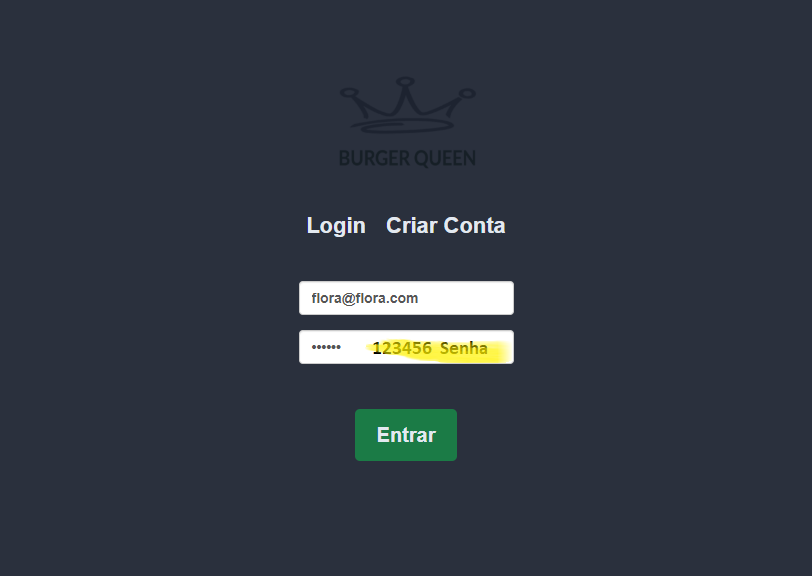
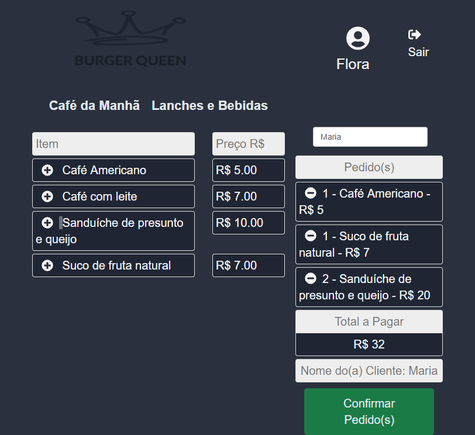
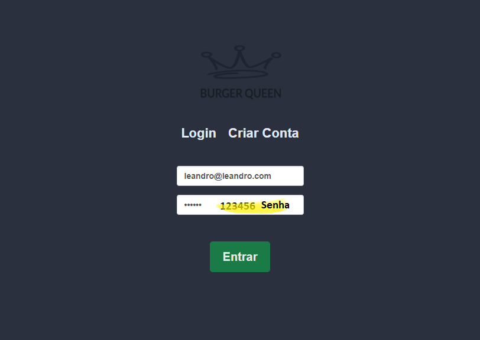
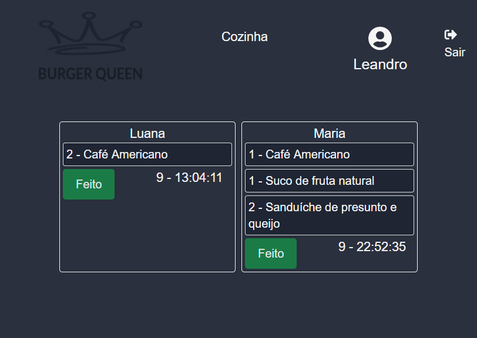

# Burger Queen

Uma aplicação de restaurante que recebe pedidos dos clientes no salão, ao confirmar vai para cozinha e depois retorna para o salão quando pronto. 

## Índice
* [Como utilizar](#como-utilizar)
* [1. Preâmbulo](#1-preâmbulo)
* [2. Resumo do projeto](#2-resumo-do-projeto)
* [3. Considerações gerais](#3-considerações-gerais)
* [4. Checklist](#4-Checklist)

***

## Como Utilizar

## Como Utilizar

### Login para Salão

### Salão

### Login para Cozinha

### Cozinha

## 1. Preâmbulo

Nesse projeto foram utilizados:
* [React](https://reactjs.org/) uma_biblioteca_ de
JavaScript;
* react-with-firebase-auth;
* @fortawesome/react-fontawesome;
* react-bootstrap.

Para desenvolver em Front-end, estes kits de desenvolvimento podem resultar em
uma grande ajuda para implementar rapidamente _features_ do projeto.

## 2. Resumo do projeto

Este projeto foi 100% por demanda.
Um pequeno restaurante de hambúrgueres, que está crescendo, necessitou de uma
interface em que se possa realizar pedidos utilizando um _tablet_, e enviá-los
para a cozinha para que sejam preparados de forma ordenada e eficiente (através
de um _backend_ que os detalhes serão dados mais adiante).

Estas são as informações que temos do cliente:

> Somos **Burger Queen**, um fast food 24hrs.
>
>A nossa proposta de serviço 24 horas foi muito bem recebida e, para continuar a
>crescer, precisamos de um sistema que nos ajude a receber pedidos de nossos
>clientes.
>
>Nós temos 2 menus. Um muito simples para o café da manhã:
>
>| Ítem                      |Preço R$|
>|---------------------------|------|
>| Café americano            |    5 |
>| Café com leite            |    7 |
>| Sanduíche de presunto e queijo|   10 |
>| Suco de fruta natural     |    7 |
>
>E outro menu para o resto do dia:
>
>| Ítem                      |Preço |
>|---------------------------|------|
>|**Hambúrgueres**           |   **R$**   |
>|Hambúrguer simples         |    10|
>|Hambúrguer duplo           |    15|
>|**Acompanhamentos**        |   **R$**   |
>|Batata frita               |     5|
>|Anéis de cebola            |     5|
>|**Bebidas**                |   **R$**   |
>|Água 500ml                 |     5|
>|Água 750ml                 |     7|
>|Bebida gaseificada 500ml   |     7|
>|Bebida gaseificada 750ml   |    10|
>
>**Importante:** Os clientes podem escolher entre hambúrgueres de carne bovina,
>frango ou vegetariano. Além disso, por um adicional de R$ 1,00 , eles podem
>adicionar queijo ou ovo.
>
>Nossos clientes são bastante indecisos, por isso é muito comum que eles mudem o
>seu pedido várias vezes antes de finalizar.

A interface deve mostrar os dois menus (café da manhã e restante do dia), cada
um com todos os seus _produtos_. O usuário deve poder escolher que _produtos_
adicionar e a interface deve mostrar o _resumo do pedido_ com o custo total.
 
## 3. Considerações gerais

Este projeto foi individual.

A lógica do projeto foi totalmente implementada em JavaScript (ES6 +), HTML e CSS e empacotada de forma automatizada. Neste projeto você deve usar [React](https://reactjs.org/).

O aplicativo deve ser um _Single Page App_. Os pedidos serão enviados por meio de um _tablet_, mas **não queremos um aplicativo nativo**, mas sim um aplicativo Web que seja **responsivo**.

#### [História de usuário 1] Usuário deve ter seu perfil (login/senha) para acessar o sistema.

Eu como funcionário do restaurante quero entrar na plataforma e ver apenas a
tela imporante para o meu trabalho.

##### Critérios de aceitação

O que deve acontecer para satisfazer as necessidades do usuário?

* Criar login e senha.
* Criar tipo de usuário (cozinha / salão).
* Entrar na tela correta para cada usuário.

#### [História de usuário 2] Garçom/Garçonete deve ser capaz de anotar o pedido do cliente

Eu como garçom/garçonete quero poder anotar o pedido de um cliente para não
depender da minha memória, saber quanto cobrar e poder enviar os pedidos para a
cozinha para serem preparados em ordem.

##### Critérios de aceitação

O que deve acontecer para satisfazer as necessidades do usuário?

* Anotar o nome do cliente.
* Adicionar o nome do garçom/garçonete ao pedido
* Adicionar produtos aos pedidos.
* Excluir produtos.
* Ver resumo e o total da compra.
* Enviar o pedido para a cozinha (guardar em algum banco de dados).
* Funcionar bem e se adequar a um _tablet_.

#### [História de usuário 3] Chefe de cozinha deve ver os pedidos

Eu como chefe de cozinha quero ver os pedidos dos clientes em ordem, poder marcar que estão prontos e poder notificar os garçons/garçonetes que o pedido está pronto para ser entregue ao cliente.

##### Critérios de aceitação

* Ver os pedidos à medida em que são feitos.
* Marcar os pedidos que foram preparados e estão prontos para serem servidos.
* Ver o tempo que levou para preparar o pedido desde que chegou, até ser marcado como concluído.

#### [História de usuário 4] Garçom/Garçonete deve ver os pedidos prontos para servir

Eu como garçom/garçonete quero ver os pedidos que estão prontos para entregá-los rapidamente aos clientes.

## 4. Checklist

#### HU

#### HU 1: Perfil de usuário

* Criar login e senha.
* Criar tipo de usuário (cozinha / salão).
* Entrar na tela correta para cada usuário.

#### HU 2: Anotar pedidos

* Digite o nome do cliente.
* Filtre _menu_ para _café da manhã_ e _almoço/jantar_.
* Adicionar item ao pedido.
* Excluir item do pedido.
* Mostra _resumo_ do pedido com todos os itens e o total.
* Enviar para a cozinha (isso deve salvar o pedido).

#### HU 3: Ver pedidos na cozinha

* Visualização de pedidos pendentes para produção.
* Marcar pedido como como pronto para entrega (roadmap).
* Ver histórico dos pedidos (roadmap).

#### HU 4: Entrega de pedidos (Roadmap)

* Visualização de pedidos pendentes para entrega.
* Marcar pedido como entregue ao cliente.
